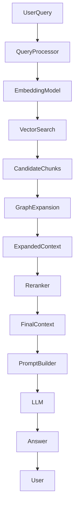
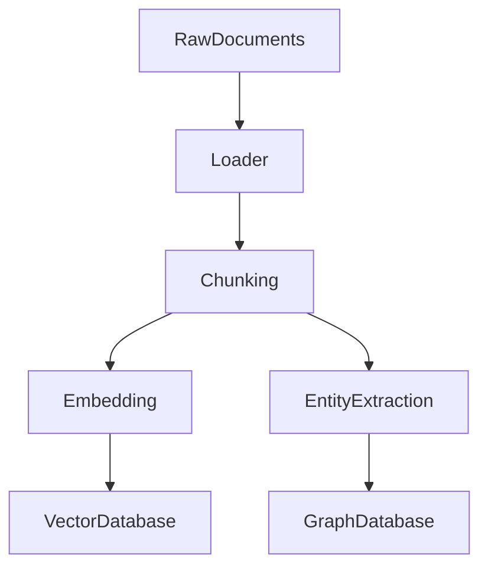
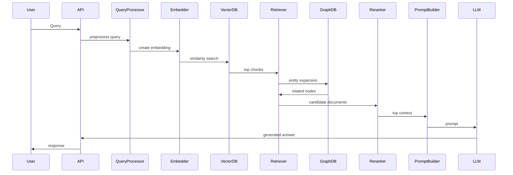

# Graph RAG System Architecture

## 1. System Overview

Graph RAG extends traditional RAG by combining:

Vector similarity search
Graph relationship traversal

This enables the system to retrieve **semantically related content and relational knowledge**.

---

# 2. High-Level Architecture

---

# 3. Data Ingestion Pipeline

Steps:

1. Documents are loaded
2. Text is split into chunks
3. Embeddings are generated
4. Chunks stored in vector database
5. Entities extracted
6. Graph relationships created

---

# 4. Retrieval Flow

Query lifecycle:

1. User sends query
2. Query converted into embedding
3. Vector database retrieves top-K chunks
4. Graph expansion retrieves related nodes
5. Context merged
6. Reranker reorders results
7. Final context passed to LLM

---

# 5. Code Architecture

Example directory structure:

src/

ingestion/
loader.py
chunker.py

embedding/
embedder.py

retrieval/
vector_retriever.py
graph_retriever.py

rerank/
reranker.py

llm/
prompt_builder.py
generator.py

api/
server.py

---

# 6. Component Interaction

---

# 7. Performance Considerations

Key performance factors:

Vector search latency
Graph traversal depth
Reranker model size
LLM response time

Optimization strategies:

limit graph hops
cache embeddings
batch retrieval

---

# 8. Security Considerations

Potential risks:

Prompt injection
Sensitive data leakage

Mitigation:

context filtering
source attribution
query validation

---

# 9. Monitoring

Metrics monitored:

Query latency
Token usage
Retrieval accuracy

Tools:

Prometheus
Grafana

---

# 10. End-to-End Pipeline Summary

1. Data ingestion
2. Chunk creation
3. Embedding generation
4. Vector indexing
5. Graph construction
6. Query embedding
7. Hybrid retrieval
8. Reranking
9. LLM generation
10. Response delivery
